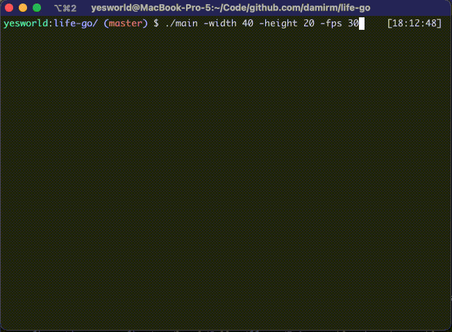

# Game of life

## Quickstart
```shell
./build.sh && ./main
```

## Options

| Option     | Description        |
|------------|---------|
| -width     | width of the surface |
| -height    | height of the surface |
| -fps       | fps rate |
| -rand-iter | amount iterations of randomization the surface |

## Keys

| Key | Description |
|-----|-------------|
|<kbd>q</kbd>| Quit |

## Demo


